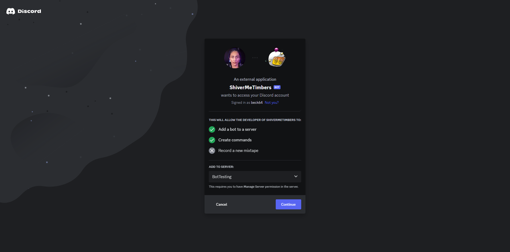

# Shiver Me Timbers Bot
## About
A discord bot that will monitor for a link to a 4chan webm, go to the link, download it, and reupload to the server in which it was posted in order to archive the content. 4chan threads eventually die and, as a result, webm links posted in the server are broken and the webm is lost.

This bot will store the webms on the discord server in a text channel called "webm-archive", which it will create automatically, if a text channel with that name does not already exist, when it is added to your server.

## Name
The name "Shiver Me Timbers" comes from a video created by Varli Singh. I can't find the original video on her platform, but here's a link to a post on [Reddit](https://www.reddit.com/r/TikTokCringe/comments/nby4fb/humpty_dumpty/) showing the video. It's super strange and was the main motivation to make this bot after stumbling upon it on a 4chan thread.

## Invite
Invite the bot to your server by clicking the button below

This will bring you to a page where you can specify which server you want to add the bot to. You'll need to be either the server owner or have administrative privledges in the server you're trying to add the bot to.

Once the bot is added, you should see it in the member list.

You can view the bot's profile for additional information about roles and permissions.

## Contact
If you have any questions, contact me directly

Email: BeckSM64@gmail.com 
Discord: Beck64
